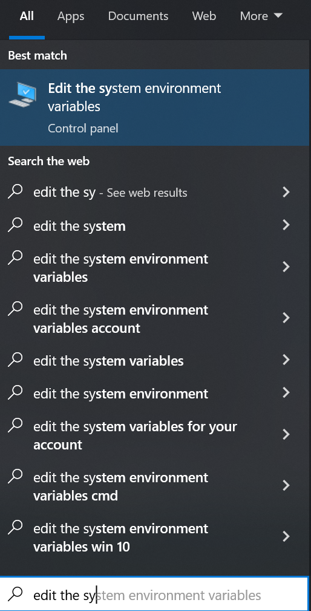
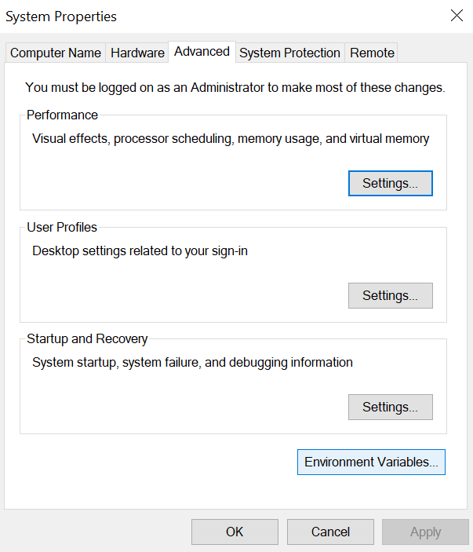
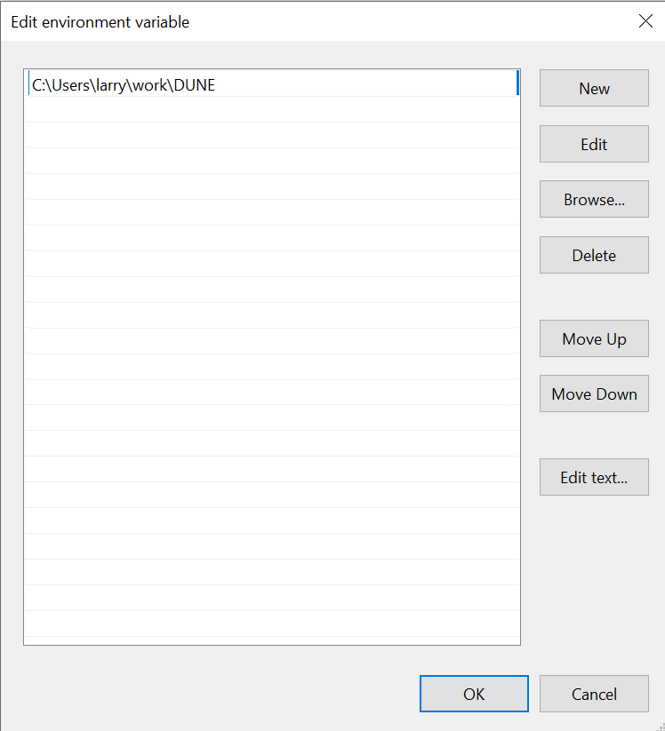

# D.U.N.E.
Docker Utilities for Node Execution


## Getting Started
First we must install [Docker](https://docs.docker.com/get-docker/).


Once you select the Docker Desktop for your operating system the installation process is very straight forward.

## `Linux`
They have both .DEB and .RPM packages available.  If you can't get these to work for some reason most repos have packages available for the engine and auxillary components.

When finished installing. Check the installation with the command 
```console
$ docker --help
```

This should display the list of commands and features.  If it fails with unknown command the installation did not work correctly.

### `Python3`
Depending on the distro you are using will determine which python3 package to install.

| Distro | Package Name |
|--------|--------------|
| Ubuntu | python3 |
| RHEL   | rh-python36 * (need to use `scl enable rh-python36 bash`)| 
| Centos | python3 |
| Arch   | python |


### `Add DUNE To Path`
To keep from having to install files to the users system, the perferred method of usage is to add this directory to your 'PATH'.
```console
$ echo "PATH=<LocationOfDUNE>:$PATH" >> .bashrc
```

Pick your preferred terminal application and input the following command:

```console
<PathToDUNE>/DUNE$ ./bootstrap.sh
```
## `Windows 10 & 11`
You might need to turn on hardware virtualization in the BIOS of your computer.  Docker should give an error stating this failure.
Because of the variance of motherboards and BIOS implementations we can't give a clear description as to how to turn this on, but a quick google search with your PC make and model should find the information you would need.

You can then start the program `Docker Desktop`

You should see the following:


### `Python3`
To install Python3 on Windows is pretty straightforward.

Go to [Python3](https://python.org/downloads)
You should see the link for Python 3.10.4:


### `Add DUNE To Path`
To keep from having to install files to the users system, the perferred method of usage is to add this directory to your 'PATH'.
Goto to Start Search and type `edit the system` and choose `Edit the system enviroment variables`



From here you should click on the button marked `Environment Variables`



From here select the line with `Path` and select `Edit...`


From here add a new line with the location of the downloaded DUNE project:



Pick your preferred command line application and input the following command:
```console:
C:\<PathToDUNE>\DUNE$ .\bootstrap.bat
```

## `Mac OS`
*** M1 Users ***
You will need to do a `git checkout arm64` from this repo.

When finished installing. Check the installation with the command. 
```console
$ docker --help
```
### `Python3`
Python3 should already be installed.

### `Add DUNE To Path`
To keep from having to install files to the users system, the perferred method of usage is to add this directory to your 'PATH'.
```console
$ echo "PATH=<LocationOfDUNE>:$PATH" >> .bashrc
```

Pick your preferred terminal application and input the following command:

```console
<PathToDUNE>/DUNE$ ./bootstrap.sh
```

## `DUNE Commands`
---
### -h, --help
---
This will display the available commands and a small description of each and argument values.

---
### --start
---
This will start a new node for deploying smart contracts and send actions against
This command takes a name of your choosing and an optional `config.ini` (look at scripts/config.ini for reference).

---
### --stop
---
This will stop a node that is running.
This command takes a name of a node that was previously started.

---
### --remove
---
This will remove a node from the system.
This command takes a name of a node that was previously started.

---
### --list
---
This will print the status of all nodes currently in the system.
It will display if the node is active, running, and the ports for http/p2p/SHiP.

---
### --simple-list
---
Does the same thing as `--list` but does not use unicode and other formatting for use with scripts or plugins.

---
### --set-active
---
This will set a node as the current active node.
This command takes a name of a node that was previously started.

---
### --get-active
---
This will return the name of the currently active node.

---
### --export-node
---
This will create a snapshot and tar ball the state snapshot, blocklog and index and export to desired location.
This command takes a name of a node that was previously started, and a directory to save the exported node contents.

---
### --import-node
---
This will import a previously exported node.tgz.
This command takes the path of the export and the name of what you want to name the imported node.

---
### --monitor
---
This will return information from the currently active node.

---
### --import-dev-key
---
This will import a private key into the precreated developer wallet.
This command takes a private key.

---
### --create-key
---
This will produce a public key and private key pair for development uses.
---
### --export-wallet
---
This will export the system wallet to a directory.
This command takes a path to place the wallet.
---
### --import-wallet
---
This will import an exported wallet from a given location.
This command takes a path that points to the exported wallet.
---
### --create-account
---
This will create a new 'on chain' account.
This command takes an `EOSIO` compatible name an optional Creator (also a valid `EOSIO` name).

---
### --create-cmake-app
---
This will produce a new smart contract project that utilizes CMake as its build system.
This command takes a project name and a directory.

---
### --create-bare-app
---
This will produce a new smart contract project that is bare, i.e. uses only `cdt-cpp` tools.
This command takes a project name and a directory.

---
### --cmake-build
---
This will build a given cmake app project.
This command takes a directory to the project and optional CMake flags.

---
### --destroy-container
---
This will destroy and remove the currently running container.  WARNING! This will delete all data that is running.
This is useful if you need to update to a new version of DUNE or if you corrupt the container some how.

---
### --stop-container
---
This will stop the currently running container.

---
### --start-container
---
This will start the `dune` container.

---
### --set-system-contract
---
This will deploy the system contract to an account.
This command takes a valid `EOSIO` name.

---
### --set-bios-contract
---
This will deploy the bios contract to an account.
This command takes a valid `EOSIO` name.

---
### --set-token-contract
---
This will deploy the token contract to an account.
This command takes a valid `EOSIO` name.


---
### --bootstrap-system
---
This will install the boot contract to `eosio` and activate all protocol features.

---
### --bootstrap-system-full
---
This will install the boot contract to `eosio` and activate all protocol features.  It will also create all accounts needed for `mandel.contracts` and deploy the system, token and msig contract.

---
### --send-action
---
This will send an action to an account.
This command takes an valid `EOSIO` account name, a valid `EOSIO` action name, the data payload needed and the permission.
---
### --get-table
---
This will get table data from the specified table.
This command takes an valid `EOSIO` account name, a table scope, and table name.

---
### --activate-feature
---
This will activate a protocol feature.
This command takes a code name for the protocol feature.

---
### --list-features
---
This will list the available protocol feature code names.
---
### --start-webapp
---
This will start a simple webapp, like the one in `example/webapp`
This command takes a directory of the webapp.

---
### -- (Not listed with -h)
This will allow you to call the tool and pass through to the underlying system.
---

## `Concepts and Operations`
The core concept of this utility is to abstract over `nodeos`, `cleos`, `CDT`, etc.
As such some of the commands might seem restrictive.  Please take note that if you find any of the commands to be too
restrictive then you can use the command `--` followed by whatever normal `cleos`, `nodeos`, `CDT` and `OS` commands that you need.

When you run any command with DUNE if a container has not been created yet it will automatically create one for you.  The command of 
`start-container` shouldn't necessarily be needed during normal operation.

A developer wallet is automatically created for you and is always unlocked and none of the commands will ever ask you to unlock the wallet.  If you need to run any `cleos` wallet commands or `keosd` commands via `--` and the wallet is locked, then simply run one of the wallet commands from DUNE first and it will unlock the wallet.

If you deploy a smart contract to an account it will automatically add the `code` permission to that account for you.

The drive/directory that your workspace is in is mapped into the container and prefixed with `/host`.
So on Windows this would be `/host/Users/<name>/<some path>`.
On Linux and Mac this would be something like `/host/home/<name>/<some path>`.

## `Node Management`
For all of the deployment commands and most of the commands in general you have to have at least one node up and running.

Let's create a new node.

```console
$ dune --start test_node
```

This will create a new Mandel node and start it running.

If you have custom ports or options you need for the node, a config.ini file can be provided.

```console
$ dune --start test_node <path-to-config>/config.ini
```

Now let's say that we are done with thtat node for a while, then we can stop any node we want.
```console
$ dune --stop test_node
```

From here we can also remove any node via `--remove <node name>`.

The command `--list` will provide a listing of nodes in the current container.

```console
$ dune --list
```


This gives us information about the nodes, their particular ports, if the node is running and a new concept of is the node `active`.

The way DUNE operates is state based, so you set the active node to which node you want and fire away at the commands and any that are directed towards the nodes or are listening to nodes will set their URL information correctly and immediately.  This state persists after shutting down the software.

When you create a new node, as long as it is successful, it will automatically switch to that node as the active node.

You can manually set the active node with the command `--set-active <node name>`.
### `Multiple Nodes`
When creating multiple nodes you have the option to stop the currently running node if the ports clash or change the ports via the config.ini and start the node in parallel.

If we start them in parallel we can create complex topologies of nodes via the config.ini and try to replicate things like an EOS mainnet or the like.

These types of topologies are out of the scope of this readme but please look at documentation for Mandel/EOSIO node configurations.

## Contract Development
### `CMake Contract Development`
Let's start by creating a new project in our workspace.
```console
$ dune --create-cmake-app hello ./
```

This should produce a file structure like the picture below:


Modify the source code how you like.

Then, let's compile the contract.

```console
$ dune --cmake-build ./
```


### `Bare Contract Development`
Let's start by create a new bare project in our workspace.
```console
$ dune --create-bare-app hello ./
```
This should produce a file structure like the picture below:


Modify the source code how you like.

Then, let's compile the contract.

```console
$ dune -- cdt-cpp /host/<path>/hello/hello.cpp -o /host/<path>/hello/hello.wasm
```

### `Creating accounts Deploying Smart Contracts`
Let's start off by creating some accounts.

```console
$ dune --create-account bucky
$ dune --create-account test
$ dune --create-account areg
```

From here we can deploy built smart contracts.

```console
$ dune --deploy ./hello bucky
$ dune --deploy ./example/talk/build/talk test
$ dune --deploy ./sudo/build/sudo areg
```

### `Sending Actions`
Let's send some actions to the accounts.
```console
$ dune --send-action bucky hi '[bucky]' bucky@active
$ dune --send-action test post '[1, 0, bucky, "message"]' test
$ dune --send-action areg wrap ...
```

### `Table Information`
The only current command open is `--get-table` which is analogous to `cleos get table`.
```console
$ dune --get-table <ACCOUNT> <SCOPE> <TABLE NAME>
```

This will allow for all of the same utilities from cleos itself.  As we move forward my hope is that these utilities can be greatly expanded upon.

### `DApp/WebApp`
The services through the docker container are exposed at 8888 for http, 9876 for p2p and 8080 for SHiP.  You will need to ensure the a running node is using those ports.
## `Account Management`
We've seen a simple way to produce accounts above `--create-account <ACCOUNT NAME>`.

But we also have the ability to supply the creator of the account and the public and private key optionally.

```console
$ dune --create-account bucky foo
```
Will create an account of `bucky` who's creator was `foo` and auto generate the public and private key and auto import into the development wallet.

Or,

```console
$ dune --create-account bucky foo EOS7qPSKJhqygQTSNjMy8aH6TL6NtsYJnBJ7fxh7Y4SFLiXYdhjGD 5KNYGzaLo9aTjiXG7oeKGy5JWkQVkAha1Xi9DXNedvojovPhnLC
```

Clearly you don't want to do this with real private keys or sensitive accounts.

## Bootstrapping Nodes
At some point you will want to activate protocol features for your chain.

This can be achieved in a few ways with DUNE.

The first is by using the command `--activate-feature`.

This will require you to know which protocol features you want to enable.  A list of available features are listed via `--list-features`.

If will try to preactivate the protocol features if it hasn't already done so, so you shouldn't have to worry about that step.

Next is using one of the two `bootstrapping` commands.

The first is `bootstrap-system`,
```console
$ dune --bootstrap-system
```

This will preactivate protocol features, set the boot contract and activate all protocol features.

The second is `bootstrap-system-full`,
```console
$ dune --bootstrap-system-full
```

This will do the same as `--bootstrap-system` but additionally set the contracts from MANDEL.Contracts and create the correct accounts needed for those.
## System Level
### `Wallet`
The default wallet is created for you and always unlocked for you when using this system.  The wallet of DUNE is not in any way designed to be a `secure` wallet.

During testing or replication of state we sometimes might want to import a previous wallet.

DUNE exposes two commands `--export-wallet` and `--import-wallet <WALLET DIR>`.

`export-wallet` will produce a `.tgz` at the current location called `wallet.tgz`.


`import-wallet` will take the directory of the `wallet.tgz` and import it over the current wallet of the system.

You can also create a public key private key pair with the command `--create-key`.

And lastly, we can import a development key if we need to manually do so with the command `--import-dev-key`.

### `Container`
Sometimes the running container can get corrupted or overly large and you will want to purge it and start fresh.

To do this use the command `destroy-container`.

```console
$ dune --destroy-container
```

This will stop the running container and erase it.

When you are done for the day it is best practice to stop the container, which is exposed via `stop-container`.

```console
$ dune --stop-container
```

This will stop all running nodes safely, and then stop the running container.

And lastly, if you are building some IDE plugin support or ancillary tooling you will want to start the container.
```console
$ dune --start-container
```

As mentioned above all commands that use the container will automatically create a new container if one does not exist and automatically start the container if is stopped.