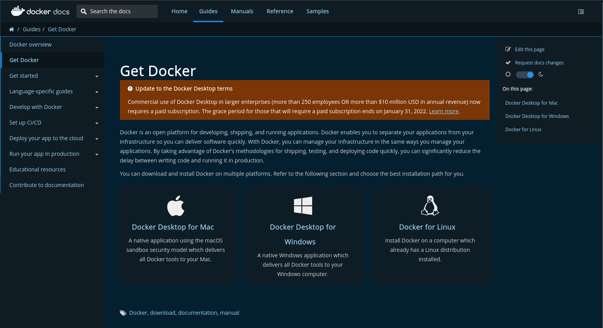
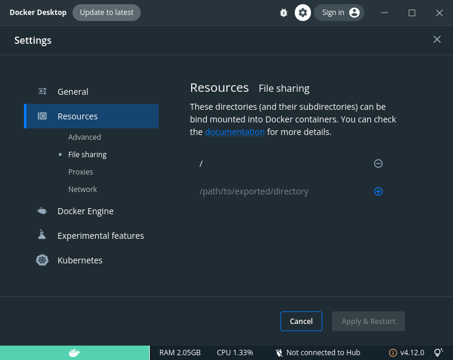
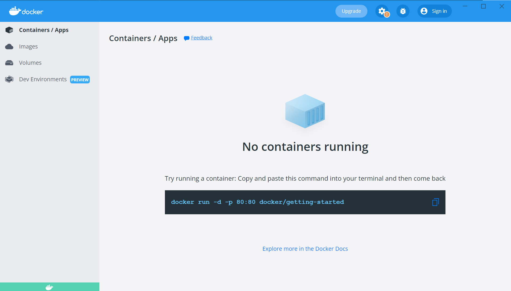
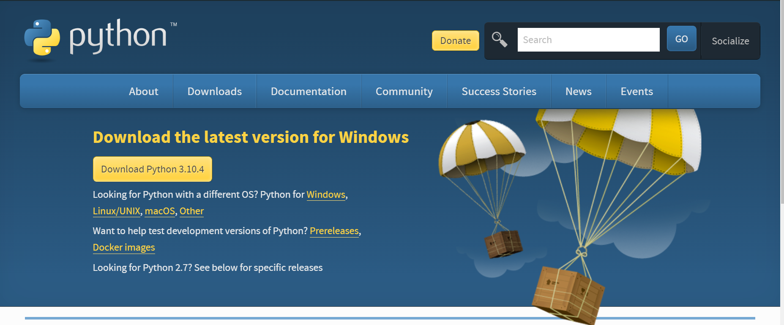
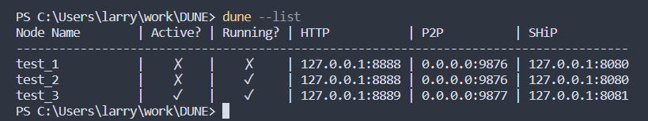
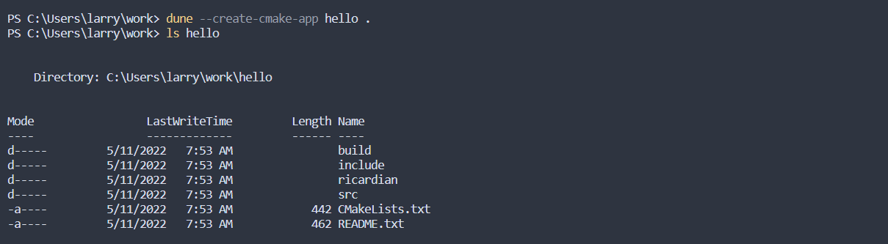
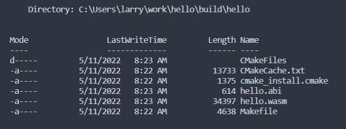
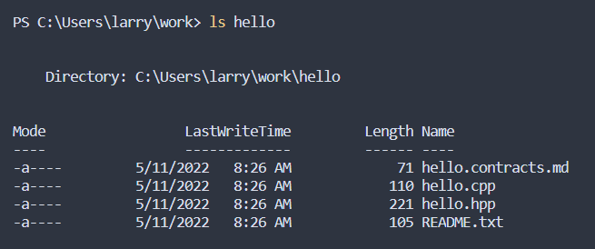
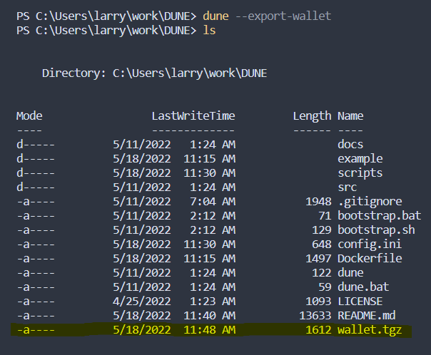

# Docker Utilities for Node Execution (DUNE)


Docker Utilities for Node Execution (DUNE) is a tool to abstract over [Leap](https://github.com/AntelopeIO/leap) programs, 
[CDT](https://github.com/AntelopeIO/cdt), and other services/tools to perform the functions of node management, compiling smart contracts, 
running tests, and several other common tasks required to develop smart contracts on [Antelope](https://github.com/AntelopeIO) blockchains.

## Getting started

First we must install [Docker](https://docs.docker.com/get-docker/).



Once you select the Docker Desktop for your operating system the installation process is very straight forward.

### Linux - docker setup

Start your Docker Desktop, visit its settings and add the root directory of the host system to shared directories.



Check the installation with the command

```console
$ docker --help
```

This should display the list of commands and features.  If it fails with unknown command the installation did not work correctly.

### Several useful facts for working with Docker in Linux

The Docker installation package consists of two independent products which install together: Docker Engine and Docker Desktop.
  
It is easy to confuse which system you are currently working with.
  
Docker Desktop has a built-in daemon which works in parallel with the `dockerd` daemon.
  
Docker Desktop keeps its settings and storage of images and containers in the user's home directory.
  
Docker Engine keeps its settings and storage in the system directories.
  
Docker Desktop works with userns-remap turned on only. It is hardcoded and can't be changed.
  
Docker Desktop has a built-in daemon which works in parallel with the `dockerd` daemon.   

Therefore, to successfully work with DUNE you should:

>+ Download the latest DUNE release on [Windows](#dune-windows) or on [Linux](#dune-linux "Linux")
>+ Add a root directory of the host system to the list of shared directories in Docker Desktop settings.
>+ Keep Docker Desktop running all the time when you work with DUNE.


#### Python 3

Depending on the distro you are using will determine which `python3` package to install.

| Distro | Package Name                                              |
| :----- | :-------------------------------------------------------- |
| Ubuntu | python3                                                   |
| RHEL   | rh-python36 * (need to use `scl enable rh-python36 bash`) |
| Centos | python3                                                   |
| Arch   | python                                                    |

### DUNE installation on Linux <a name="dune-linux"></a>

This is the fastest way to get started. From the [latest release](https://github.com/AntelopeIO/DUNE/releases/latest) page, download DUNE `*.deb` file or visit the [release tags](https://github.com/AntelopeIO/DUNE/releases) page to download specific version of DUNE deb package.

Once you have a `*.deb` file downloaded, you can install it as follows:
```bash
sudo apt-get update
sudo apt-get install -y ~/Downloads/antelopeio-dune*.deb
```
Your download path may vary.

#### Alternative: DUNE installation using RPM package

From the [latest release](https://github.com/AntelopeIO/DUNE/releases/latest) page, download DUNE `*.rpm` file.

Once you have a `*.rpm` file downloaded, you can install it as follows:
```bash
sudo rpm -i ~/Downloads/antelopeio-dune*.rpm
```
Your download path may vary.

#### DUNE installation - verification

Finally, verify DUNE was installed correctly in `/usr/opt/DUNE/`. First [add DUNE to Path](#add-dune-to-path) and check:
```bash
dune --version
```
You should see a DUNE version number. For example:
```
v1.0.0
```

Latest DUNE docker image will be downloaded automatically when starting the DUNE as described in [Node management](#node-management).
#### Add DUNE to PATH

To keep from having to install files to the user's system, the preferred method of usage is to add this directory to your `PATH`.

```console
$ echo "PATH=<LocationOfDUNE>:$PATH" >> .bashrc
```
### Rebuild the DUNE image

If you want to rebuild the DUNE image pick your preferred terminal application and input the following command:

```console
<PathToDUNE>/DUNE$ ./bootstrap.sh
```

### Windows 10 & 11

In some cases (i.e. running Docker from VirtualBox) you might need to turn on hardware virtualization in the BIOS of your computer.  Docker should give an error stating this failure.
Because of the variance of motherboards and BIOS implementations we can't give a clear description as to how to turn this on,
but a quick google search with your PC make and model should find the information you would need.

You can then start the program `Docker Desktop`.

You should see the following:



#### Python 3

Installing Python 3 on Windows is pretty straightforward.

Visit the download page for [Python 3](https://python.org/downloads). You should see the link to the latest Python 3:



Make sure you mark "Add Python to PATH" during installation.
After installation open `cmd.exe` and verify `python --version` returns current Python version.

#### DUNE installation on Windows <a name="dune-windows"></a>

1. Install [Chocolatey](https://docs.chocolatey.org/en-us/choco/setup).
2. Download latest `*.nupkg` from [latest release](https://github.com/AntelopeIO/DUNE/releases/latest) page.
3. Run PowerShell as administrator and go to the directory where your *`.nupkg` was downloaded.
4. Run following commands:
```
choco uninstall antelopeio-dune -y
choco install python docker-desktop -y
choco install .\antelopeio-dune.1.1.0.nupkg -y
```
5. Restart your computer (this is because %PATH% has to be reloaded. In cmd.exe it is enough to run command `refreshenv`).
6. Open PowerShell / cmd.exe and try that following command works: `dune.bat --version`.

**NOTE**: Chocolatey does not detect python / docker-dekstop installed via other means, so it is possible some dependencies will be installed twice. Usually it is not an issue, but if it is you can follow [this solution](https://stackoverflow.com/a/71605170).

Due to current Docker Desktop limitations DUNE supports only `C:/` disk drive, so all your DUNE projects or workspace needs to be on `C:/` drive.

### Mac OS

When finished installing. Check the installation with the command. 
```console
$ docker --help
```
#### Python 3

Python 3 should already be installed.

#### Add DUNE to PATH

To keep from having to install files to the user's system, the preferred method of usage is to add this directory to your `PATH`.

```console
$ echo "PATH=<LocationOfDUNE>:$PATH" >> .bashrc
```

## DUNE commands

---

**-h** or **--help** 
This will display the available commands and a small description of each and argument values.

---

**--start** 
This will start a new node for deploying smart contracts and send actions against. 
This command takes a name of your choosing and an optional `config.ini` (look at scripts/config.ini for reference).

---

**--stop** 
This will stop a node that is running. This command takes a name of a node that was previously started.

---

**--remove** 
This will remove a node from the system. This command takes a name of a node that was previously started.

---

**--list** 
This will print the status of all nodes currently in the system. 
It will display if the node is active, running, and the ports for http/p2p/SHiP.

---

**--simple-list** 
Does the same thing as `--list` but does not use unicode and other formatting for use with scripts or plugins.

---

**--set-active** 
This will set a node as the current active node. This command takes a name of a node that was previously started.

---

**--get-active** 
This will return the name of the currently active node.

---

**--export-node** 
This will create a snapshot and tar ball the state snapshot, blocklog and index and export to desired location. 
This command takes a name of a node that was previously started, and a directory to save the exported node contents.

---

**--import-node** 
This will import a previously exported node.tgz. 
This command takes the path of the export and the name of what you want to name the imported node.

---

**--monitor** 
This will return information from the currently active node.

---

**--import-dev-key** 
This will import a private key into the pre-created developer wallet. This command takes a private key.

---

**--create-key** 
This will produce a public key and private key pair for development uses.

---

**--export-wallet** 
This will export the system wallet to your current directory.

---

**--import-wallet** 
This will import an exported wallet from a given location. This command takes a path that points to the exported wallet.

---

**--create-account** 
This will create a new on-chain account. 
This command takes a compatible name for the new Antelope account and an optional creator (also a valid Antelope account name).

---

**--system-newaccount** 
This will create a new account on the blockchain with initial resources using command `cleos system newaccount`

---

**--create-cmake-app** 
This will produce a new smart contract project that utilizes CMake as its build system. This command takes a project name and a directory.

---

**--create-bare-app** 
This will produce a new smart contract project that is bare, i.e. uses only `cdt-cpp` tools. This command takes a project name and a directory.

---

**--cmake-build** 
This will build a given CMake app project. This command takes a directory to the project and optional CMake flags.

---

**--destroy-container** 
This will destroy and remove the currently running container. 
WARNING! This will delete all data that is running. 
This is useful if you need to update to a new version of DUNE or if you corrupt the container some how.

---

**--stop-container** 
This will stop the currently running container.

---

**--start-container** 
This will start the `dune` container.

---

**--set-core-contract** 
This will deploy the core contract to an account. This command takes a valid Antelope account name.

---

**--set-bios-contract** 
This will deploy the bios contract to an account. This command takes a valid Antelope account name.

---

**--set-token-contract** 
This will deploy the token contract to an account. This command takes a valid Antelope account name.

---

**--bootstrap-system** 
This will install the boot contract to the `eosio` account and activate all protocol features.

---

**--bootstrap-system-full** 
This will install the boot contract to the `eosio` account and activate all protocol features. 
It will also create all the accounts needed by the core, token, and multisig contracts from [reference-contracts](https://github.com/AntelopeIO/reference-contracts) and deploy those three contracts to their corresponding accounts. Note that the core contract will replace the boot contract on the `eosio` account.
Following optional arguments can be provided:
- currency (default is "SYS")
- maximum value (default is "10000000000.0000"). Maximum total value of issued currency. Precision of maximum value needs to be 4.
- initial value (default is "1000000000.0000"). Initial value of issued currency to system account `eosio`. Precision of initial value needs to be 4.

---
**--send-acton** 
This will send an action to an account. 
This command takes a valid Antelope account name, a valid Antelope action name, the data payload needed and the permission.

---

**--get-table** 
This will get table data from the specified table. 
This command takes a valid Antelope account name, table scope, and table name.

---

**--activate-feature** 
This will activate a protocol feature. This command takes a code name for the protocol feature.

---

**--list-features** 
This will list the available protocol feature code names.

---

**--leap** 
Sets specific version of leap. If no version is provided then a list of available Leap versions will be displayed.

---

**--cdt** 
Sets specific version of CDT (Contract Development Toolkit). If no version is provided then a list of available CDT versions will be displayed.

---
**--version-all** 
Lists version of DUNE, leap and CDT

---

**--upgrade** 
Upgrades DUNE docker image to the latest version

---

**--** 
(Not listed with help) This will allow you to call the tool and pass through to the underlying system.

---

<br/><br/>

## Concepts and operations

The core concept of this utility is to abstract over Leap programs such as `nodeos` and `cleos`, CDT, etc. 
As such some of the commands might seem restrictive.  Please take note that if you find any of the commands to be too 
restrictive then you can use the command `--` followed by whatever normal `cleos`, `nodeos`, CDT and OS commands that you need.

When you run any command with DUNE, if a container has not been created yet it will automatically create one for you. 
The command of `start-container` shouldn't necessarily be needed during normal operation.

A developer wallet is automatically created for you and is always unlocked 
and none of the commands will ever ask you to unlock the wallet. 
If you need to run any `cleos` wallet commands or `keosd` commands via `--` and the wallet is locked, 
then simply run one of the wallet commands from DUNE first and it will unlock the wallet.

If you deploy a smart contract to an account it will automatically add the `code` permission to that account for you.

The drive/directory that your workspace is in is mapped into the container and prefixed with `/host`. 
So on Windows this would be `/host/Users/<name>/<some path>` (NOTE: on Windows only `C:/` disk drive is supported).
On Linux and Mac this would be something like `/host/home/<name>/<some path>`.

## Node management

For all of the deployment commands and most of the commands in general you have to have at least one node up and running.

Let's create a new node.

```console
$ dune --start test_node
```

If you run this for the first time DUNE docker image will be downloaded. It will create a new Leap node and start it up.

If you have custom ports or options you need for the node, a config.ini file can be provided.

```console
$ dune --start test_node <path-to-config>/config.ini
```

Now let's say that we are done with that node for a while, then we can stop any node we want.

```console
$ dune --stop test_node
```

From here we can also remove any node via `--remove <node name>`.

The command `--list` will provide a listing of nodes in the current container.

```console
$ dune --list
```



This gives us information about the nodes, their particular ports, if the node is running and a new concept of is the node `active`.

The way DUNE operates is state based, so you set the active node to which node you want and fire away at the commands 
and any that are directed towards the nodes or are listening to nodes will set their URL information correctly and immediately. 
This state persists after shutting down the software.

When you create a new node, as long as it is successful, it will automatically switch to that node as the active node.

You can manually set the active node with the command `--set-active <node name>`.

### Multiple nodes

When creating multiple nodes you have the option to stop the currently running node if the ports clash 
or change the ports via the config.ini and start the node in parallel.

If we start them in parallel we can create complex topologies of nodes via the config.ini 
and try to replicate things like an EOS mainnet or the like.

These types of topologies are out of the scope of this README but please look at documentation for Leap node configurations.

## Contract development

### CMake contract development

Let's start by creating a new project in our workspace.

```console
$ dune --create-cmake-app hello ./
```

This should produce a file structure like the picture below:



Modify the source code how you like.

Then, let's compile the contract.

```console
$ dune --cmake-build ./
```



### Bare contract development

Let's start by create a new bare project in our workspace.

```console
$ dune --create-bare-app hello ./
```

This should produce a file structure like the picture below:



Modify the source code how you like.

Then, let's compile the contract.

```console
$ dune -- cdt-cpp /host/<path>/hello/hello.cpp -o /host/<path>/hello/hello.wasm
```

### Creating accounts and deploying smart contracts

Let's start off by creating some accounts.

```console
$ dune --create-account bucky
$ dune --create-account test
$ dune --create-account areg
```

From here we can deploy built smart contracts.

```console
$ dune --deploy ./hello bucky
$ dune --deploy ./example/talk/build/talk test
$ dune --deploy ./sudo/build/sudo areg
```

### Sending actions

Let's send some actions to the accounts.

```console
$ dune --send-action bucky hi '[bucky]' bucky@active
$ dune --send-action test post '[1, 0, bucky, "message"]' test
$ dune --send-action areg wrap ...
```

### Table information

The only current command open is `--get-table` which is analogous to `cleos get table`.

```console
$ dune --get-table <ACCOUNT> <SCOPE> <TABLE NAME>
```

This will allow for all of the same utilities from cleos itself. 
As we move forward we hope to greatly expand upon these utilities.

### DApp/WebApp

The services through the docker container are exposed at 8888 for http, 9876 for p2p and 8080 for SHiP. 
You will need to ensure the running node is using those ports.

## Account management

Earlier we saw a simple way above to create accounts using `--create-account <ACCOUNT NAME>`.

But we also have the ability to supply the creator of the account and the public and private key optionally.

```console
$ dune --create-account bucky foo
```

The above command will use the existing `foo` account to create a new account account called `bucky` 
and it will automatically generate the public and private key pair for this account and import the private key into the development wallet.

Or, to explicitly specify the public and private key pair of the new account:

```console
$ dune --create-account bucky foo EOS7qPSKJhqygQTSNjMy8aH6TL6NtsYJnBJ7fxh7Y4SFLiXYdhjGD 5KNYGzaLo9aTjiXG7oeKGy5JWkQVkAha1Xi9DXNedvojovPhnLC
```

Clearly you don't want to do this with real private keys or sensitive accounts.

## Bootstrapping nodes

At some point you will want to activate protocol features for your chain.

This can be achieved in a few ways with DUNE.

The first is by using the command `--activate-feature`.

This will require you to know which protocol features you want to enable. 
A list of available features are listed via `--list-features`.

If will try to preactivate the protocol features if it hasn't already done so, so you shouldn't have to worry about that step.

Next is using one of the two `bootstrapping` commands.

The first is `bootstrap-system`.

```console
$ dune --bootstrap-system
```

This will preactivate protocol features, set the boot contract and activate all protocol features.

The second is `bootstrap-system-full`.

```console
$ dune --bootstrap-system-full
```

This will do the same as `--bootstrap-system` but additionally set the contracts 
from [reference-contracts](https://github.com/AntelopeIO/reference-contracts)
and create the correct accounts needed for those.

## System-level commands

### Wallet

The default wallet is created for you and always unlocked for you when using this system. 
The wallet of DUNE is not in any way designed to be a `secure` wallet.

During testing or replication of state we sometimes might want to import a previous wallet.

DUNE exposes two commands `--export-wallet` and `--import-wallet <WALLET DIR>`.

`export-wallet` will produce a `.tgz` at the current location called `wallet.tgz`.



`import-wallet` will take the directory of the `wallet.tgz` and import it over the current wallet of the system.

You can also create a public key private key pair with the command `--create-key`.

And lastly, we can import a development key if we need to manually do so with the command `--import-dev-key`.

### Container

Sometimes the running container can get corrupted or overly large and you will want to purge it and start fresh.

To do this use the command `destroy-container`.

```console
$ dune --destroy-container
```

This will stop the running container and erase it.

When you are done for the day it is best practice to stop the container, which is exposed via `stop-container`.

```console
$ dune --stop-container
```

This will stop all running nodes safely, and then stop the running container.

And lastly, if you are building some IDE plugin support or ancillary tooling you will want to start the container.
```console
$ dune --start-container
```

As mentioned above all commands that use the container will automatically create a new container if one does not exist 
and automatically start the container if is stopped.

# DUNE plugins

DUNE can be extended with custom functionality using plugins: [Documentation of DUNE plugins](docs/PLUGIN.md)

# DUNE autocompletion

DUNE supports autocompletion using `argcomplete`.
For one time activation of argcomplete in `bash` run:
`eval "$(register-python-argcomplete dune)"`
Above can be added to `.bashrc`.

Example of autocompletion:
```
user@localhost:~/$ dune --set-
--set-active          --set-bios-contract   --set-core-contract   --set-token-contract  
```

For more information about how to install autocompletion globally or in zsh:
[https://github.com/kislyuk/argcomplete#global-completion](https://github.com/kislyuk/argcomplete#global-completion)


# Preparing DUNE release

[Steps for preparing a new DUNE release](docs/RELEASE.md)